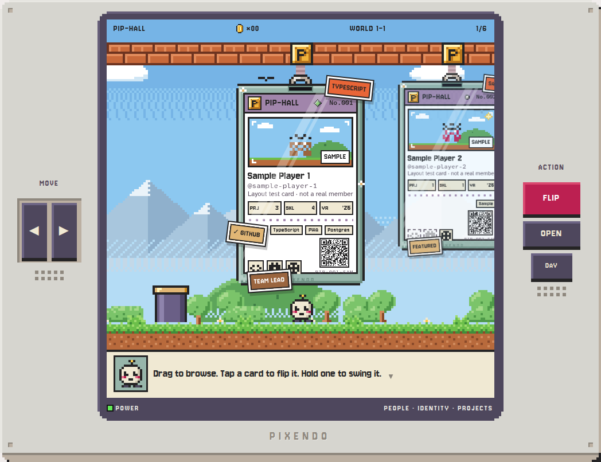
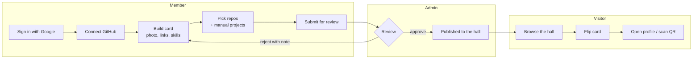
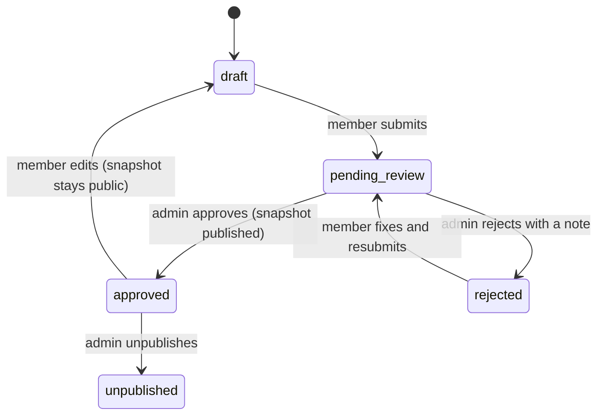
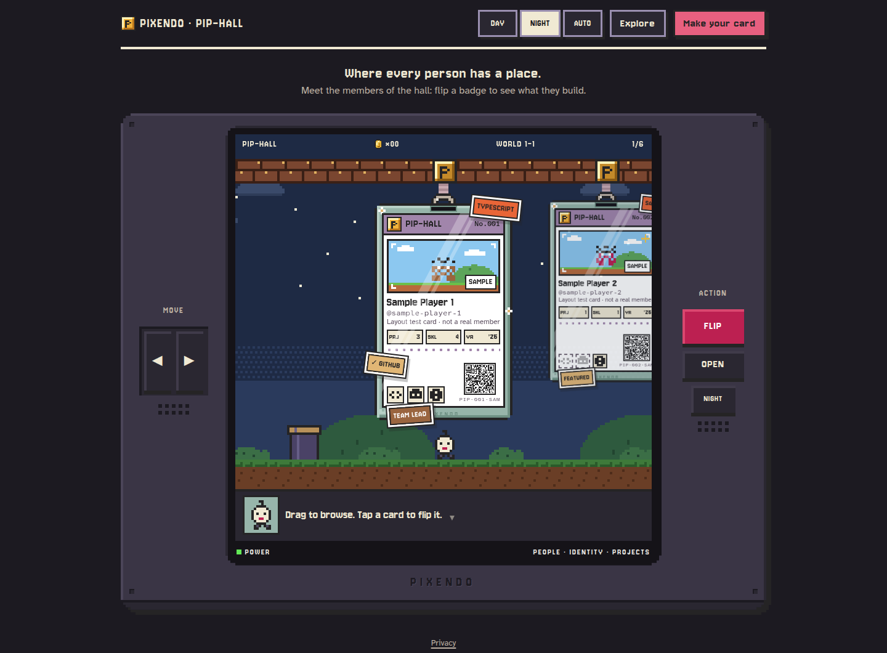
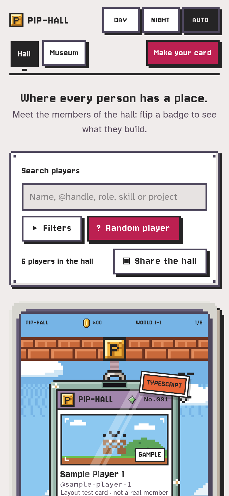
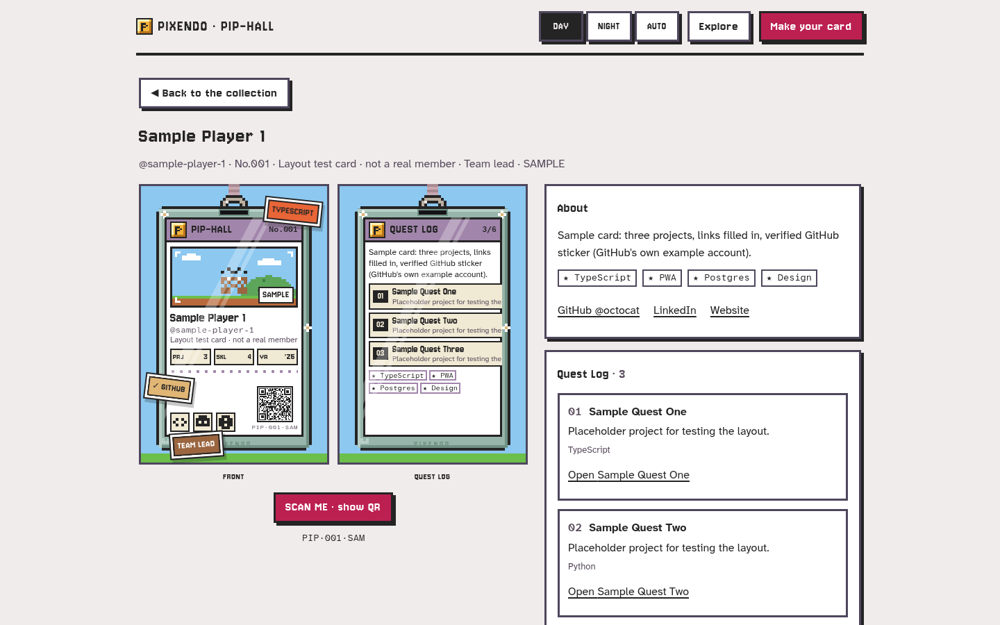
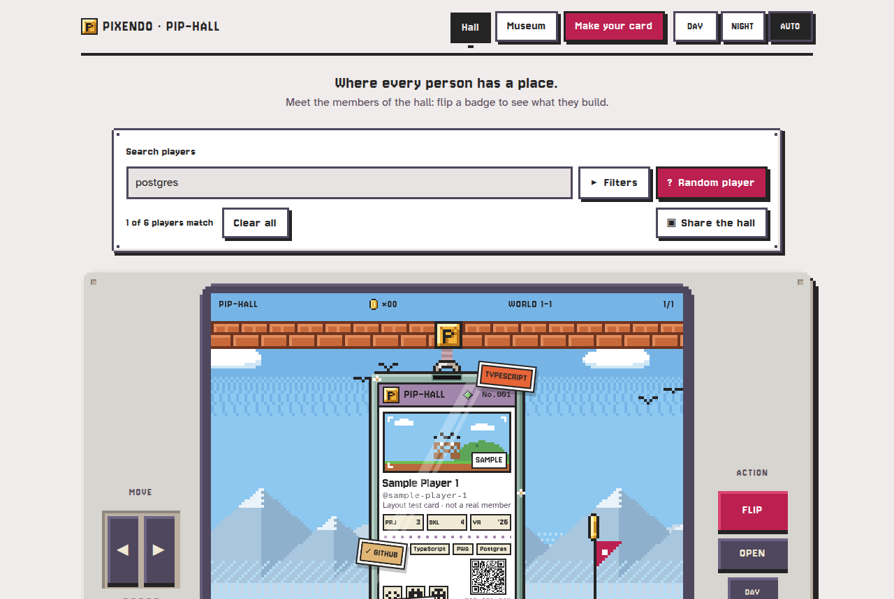
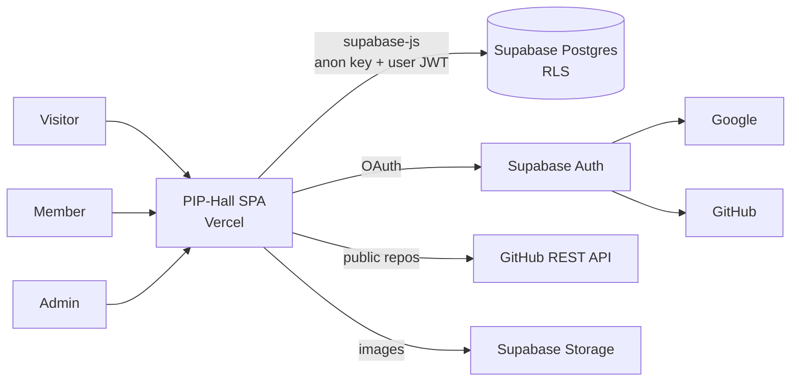

<div align="center">

# PIP-Hall

### People, Identity & Projects Hall

**Where every person has a place.**

A game-inspired digital showcase where organization members become interactive player cards.
Explore people, projects, skills, achievements, GitHub links and profiles in a playful hall
that makes discovering the people behind the work feel like browsing a game roster.


**▶ Live: [the-pip-hall.vercel.app](https://the-pip-hall.vercel.app)**



<sub>The hall in DAY mode. The badges shown are labelled sample cards, not real members.</sub>

</div>

---

## Contents

- [Overview](#overview)
- [Features](#features)
- [How it works](#how-it-works)
- [Screenshots](#screenshots)
- [Tech stack](#tech-stack)
- [Architecture](#architecture)
- [Project structure](#project-structure)
- [Getting started](#getting-started)
- [Testing](#testing)
- [Deployment](#deployment)
- [Security](#security)
- [Accessibility](#accessibility)
- [Design system](#design-system)
- [Roadmap](#roadmap)
- [Documentation](#documentation)
- [Credits](#credits)
- [Disclaimer](#disclaimer)
- [License](#license)

---

## Overview

Most member directories are a grid of identical profile tiles. PIP-Hall turns each member into a **player card**: a pixel-art ID badge hanging from a lanyard inside **PIXENDO**, an original handheld-console world.

Visitors walk through the hall like a side-scrolling level. **Pip**, PIXENDO's host, walks to whoever you're looking at. Tap a card and Pip jumps up and flips it over, revealing that member's **Quest Log**: their bio, projects and skills. Every card has a QR code that opens the member's public profile, so it works on a phone screen, a printed lanyard or a poster.

Members build their own cards. They sign in with Google, connect GitHub, pick which repositories appear, and submit the card for review. An organization admin approves it into the public hall.

| | |
|---|---|
| **For visitors** | Browse members, flip cards, search by name, skill or project, open a profile in two taps |
| **For members** | One card that holds your identity, links and real projects, imported from GitHub |
| **For admins** | A moderation queue: approve, reject with a note, unpublish, feature |

---

## Features

Status key: ✅ done · 🛠️ in progress · ⏳ planned for v1.0 (6 Oct 2026)

| Area | Feature | Status |
|---|---|---|
| **Data & security** | Postgres schema, Row Level Security, column-locked moderation, admin functions | ✅ |
| | 76 automated security tests (e.g. a member can't approve their own card) | ✅ |
| **Design** | Design system: tokens, DAY/NIGHT themes, contrast-checked palette | ✅ |
| | Playable design prototype: level, badge, handheld, motion | ✅ |
| **Hall** | Side-scrolling card carousel: drag, swipe, arrow keys, ◀ ▶ controls | ✅ (sample data) |
| | 3D card flip with jump animation, lanyard swing, coin counter | ✅ |
| | QR code on every card, with a full-screen "scan me" view | ✅ |
| **Members** | Google sign-in, connect GitHub (verified handle) | ✅ (needs your Supabase project) |
| | Card editor with live preview, photo upload, generated pixel avatar | ✅ |
| | GitHub repo picker (up to 6) plus manual projects | ✅ |
| | Submit for review; edits to a live card are re-reviewed while the approved version stays public | ✅ |
| **Admin** | Moderation queue: approve, reject with note, unpublish, feature, rename | ✅ |
| **Discovery** | Public profile at `/member/:username` (what the QR opens) | ✅ |
| | Search the hall: by name, handle, role, skill or project; filter by department, skill, featured; Random player walks Pip to someone. Results hang in the hall as live badges (flip, OPEN, QR) | ✅ |
| **Account** | Settings: email choices, theme, sign out, delete account | ✅ |
| **Museum** | A public gallery of members' projects, shuffled each visit; admins give affiliations (e.g. CS Student) that grant Museum access, and members choose which approved projects to show | ✅ |
| **PIPs** | Earn PIPs for discovering members and getting projects approved; achievements on profiles (behind `VITE_FEATURE_PIPS`) | ✅ |
| **App** | Installable PWA with an offline shell and iOS install steps | ✅ |

---

## How it works



**Card lifecycle.** Every member has a private **draft** and, once approved, a public **snapshot**. Visitors only ever see snapshots. Editing an approved card puts the draft back into review, and the old snapshot stays public until the new version is approved.



---

## Screenshots

From the production build. The badges are labelled sample cards, not real members.

| Night mode | Phone |
|:---:|:---:|
|  |  |

| Member page (what the QR opens) | Searching the hall |
|:---:|:---:|
|  |  |

The original design prototype, `docs/design/lab.html`, and its badge anatomy diagram are in [`docs/images/`](docs/images/).

---

## Tech stack

| Layer | Choice | Why |
|---|---|---|
| UI | **React 19**, **TypeScript** (strict), **Vite** | Fast dev loop, typed components, static build |
| Styling | **Tailwind CSS 4**, theme generated from design tokens | One source of truth for colour, type and spacing |
| Motion | Hand-written springs on one `requestAnimationFrame` loop + canvas sprites | Spring physics for the camera and swing, stepped frames for pixel art, no animation library (D-031) |
| Routing | **React Router** | Public and protected routes in one SPA |
| Backend | **Supabase**: Postgres, Auth, Storage | Auth, database and file storage on one free tier; no custom server |
| Auth | Google OAuth + linked GitHub identity | Google for contact email, GitHub for a verified handle and repos |
| Projects | GitHub REST API (public repos, no token) | Members import their real work in one step |
| PWA | `vite-plugin-pwa` | Installable on phones, offline app shell |
| Hosting | **Vercel** (Hobby) | Static hosting with SPA rewrites and preview deploys |
| Fonts | Jersey 10, Atkinson Hyperlegible Next and Mono (all OFL, self-hosted) | Pixel display face plus a highly legible body face |

Every service fits a free tier at organization scale (a few hundred members). See [`docs/ARCHITECTURE.md`](docs/ARCHITECTURE.md#9-deploy-environments-ci) for the limits.

---

## Architecture



- **No server of our own.** The browser talks directly to Supabase. Security lives in the database: Row Level Security, column-level grants, and `security definer` functions for every state change.
- **Drafts vs. snapshots.** `profiles` and `projects` hold private drafts. `published_cards` holds the public snapshot and is written only by admin functions ([ADR-002](docs/adr/ADR-002-published-snapshot.md)).
- **One gateway to data.** Only modules in `src/services/` import the Supabase client, so components never touch the database directly.
- **Custom carousel.** Hand-written instead of a slider library, because cards hang, swing and overlap. It renders only the current card and two on each side ([ADR-001](docs/adr/ADR-001-stack-carousel.md)).

---

## Project structure

```text
pip-hall/
├── .github/workflows/ci.yml      # Database security tests on every push
├── CLAUDE.md                     # Build rules for coding agents
├── README.md
├── package.json
├── docs/
│   ├── ARCHITECTURE.md           # Stack, data model, security, routes, NFRs
│   ├── DECISIONS.md              # Decision log (D-001 …)
│   ├── adr/                      # Architecture decision records
│   ├── build/PHASE-1..6.md       # One build brief per phase
│   ├── design/
│   │   ├── DESIGN_BRIEF.md       # Visual system, construction specs, motion catalog
│   │   ├── tokens.json           # Design tokens (source of truth)
│   │   └── lab.html              # Playable design prototype
│   ├── images/                   # README screenshots
│   ├── plan/build-plan.html      # v1 build plan page (history)
│   └── spec/                     # Original product spec (working title: PIXEL PASS)
├── src/
│   └── styles/theme.css          # Generated from tokens.json; don't edit by hand
└── supabase/
    ├── migrations/               # Schema, RLS, functions, storage buckets
    ├── seed_first_admin.sql      # Promote the first admin
    └── tests/security.test.mjs   # Security tests on a throwaway Postgres
```

The application source (`src/app`, `src/components`, `src/pages`, `src/services`, …) is added in Phase 1. The planned layout is in [`docs/ARCHITECTURE.md` §7](docs/ARCHITECTURE.md#7-frontend).

---

## Getting started

### Prerequisites

- **Node.js 20+** and npm
- A **Supabase** project (free tier), for running the app against real data
- Google and GitHub **OAuth apps**, for sign-in

### 1. Clone and install

```bash
git clone https://github.com/Muj-csv/pip-hall.git
cd pip-hall
npm install
```

### 2. Run the database security tests (works today)

```bash
npm run test:db
```

This starts a throwaway Postgres, applies the migrations, and runs 76 security checks. No Supabase account needed.

### 3. Set up Supabase

1. Create a project (Singapore region is closest for Philippine users).
2. In the **SQL editor**, run the migrations in order:
   - `supabase/migrations/20261004000000_init.sql`
   - `supabase/migrations/20261004000100_storage.sql`
   - `supabase/migrations/20261004000200_image_paths.sql`
   - `supabase/migrations/20261004000300_member_no.sql`
   - `supabase/migrations/20261004000400_admin_checks.sql`
3. **Authentication → Providers:** enable **Google** and **GitHub** and paste each provider's client ID and secret.
4. **Authentication → Settings:** turn on **manual identity linking**. It's a beta feature, and it's what lets members connect GitHub to their Google account.
5. **Authentication → URL configuration:** add `http://localhost:5173` and your production URL as redirect URLs.
6. In Google Cloud, set the OAuth consent screen to **In production**. In Testing mode only listed test users can sign in.
7. Sign in to the app once, then put your Google email into `supabase/seed_first_admin.sql` and run it in the SQL editor to make yourself admin.

### 4. Configure environment

```bash
cp .env.example .env
```

| Variable | Example | Purpose |
|---|---|---|
| `VITE_SUPABASE_URL` | `https://xyzcompany.supabase.co` | Your Supabase project URL |
| `VITE_SUPABASE_ANON_KEY` | `eyJhbGciOi…` | Public anon key (safe in the browser) |
| `VITE_DATA_SOURCE` | `fixture` or `supabase` | `fixture` runs on sample cards with no backend |
| `VITE_PUBLIC_ORIGIN` | `http://localhost:5173` | Base URL encoded in QR codes |

> **Never** put the Supabase service-role key or OAuth client secrets in `.env`, the repo, or the browser bundle. They belong only in the Supabase dashboard.

### 5. Scripts

| Command | What it does | Available |
|---|---|---|
| `npm run test:db` | Apply migrations to a throwaway Postgres and run the security tests | ✅ now |
| `npm run dev` | Start the Vite dev server on `:5173` | ✅ |
| `npm run typecheck` | TypeScript check | ✅ |
| `npm run lint` | Lint | ✅ |
| `npm test` | Unit tests (Vitest) | ✅ |
| `npm run test:e2e` | End-to-end tests (Playwright) | ✅ |
| `npm run build` | Production build (includes the service worker) | ✅ |

To preview the design right now, open `docs/design/lab.html` in a browser.

---

## Testing

| Layer | Tool | What it proves |
|---|---|---|
| Database security | `supabase/tests/security.test.mjs` on embedded Postgres | Members can't approve, feature or edit other people's cards; images must live in the member's own Storage folder; visitors only see approved snapshots; edits after approval go back to review; usernames lock after approval; max 6 projects |
| Units | Vitest | Carousel index math, avatar and sticker determinism, validators, image resizing, search and filters |
| End to end | Playwright | Sign in → build card → submit → approve → appears in the hall; flip, drag, keyboard; QR route |
| Design | AEGIS checks | Token contrast in both themes, layout at 390/768/1440px, no hard-coded colours |

---

## Deployment

Step by step, with checks: [`docs/DEPLOY.md`](docs/DEPLOY.md). In short:

1. Import the repo into **Vercel** (framework: Vite).
2. Add the four `VITE_*` environment variables (`VITE_DATA_SOURCE=supabase`, `VITE_PUBLIC_ORIGIN` = the production URL).
3. `vercel.json` rewrites every non-file route to `index.html`, so cold links like `/member/your-name` (what a QR scan opens) don't 404.
4. Add the production URL to Supabase's redirect URLs.
5. `.github/workflows/keepalive.yml` reads one public card every Monday so the free Supabase project isn't paused for inactivity. Add the repository secrets `SUPABASE_URL` and `SUPABASE_ANON_KEY` (Settings → Secrets and variables → Actions); without them the job fails, so you notice before the project pauses. Check Supabase's current terms before relying on it.

---

## Security

- **Row Level Security on every table.** Drafts are readable only by their owner and admins.
- **Column-level grants.** Members have no write access to `status`, `is_featured`, `review_note`, `github_username` or `username_locked`.
- **Moderation only through functions.** `approve_profile`, `reject_profile`, `unpublish_profile`, `set_featured` and `admin_set_username` check `is_admin()` themselves.
- **Verified GitHub handle,** copied server-side from the linked identity and never typed into a form.
- **Images only from our own Storage.** Cards store a path inside the member's own folder (`<uid>/<uuid>.webp`), never a free URL, so an approved photo can't be swapped from outside.
- **URL validation** in the browser and again as database constraints (HTTPS only, LinkedIn domain, GitHub repo shape).
- **Public email is opt-in** and shown as tap-to-reveal text.
- **Only public keys in the browser.**

Found a security issue? Please contact the maintainer privately rather than opening a public issue.

---

## Accessibility

- WCAG 2.2 AA contrast, verified for every text and background pair in both themes
- Full keyboard path: ←/→ move, Enter/Space flip, O opens a profile, Esc goes back
- `prefers-reduced-motion` turns off swing, jumps, typing, the iris wipe and the boot animation
- 44px touch targets; status shown by shape and text, never colour alone
- Alt text on every photo; the dialogue box announces changes politely to screen readers

---

## Design system

PIP-Hall's look comes from two references: a pixel-art handheld scene (bezel, dialogue box, cozy palette) and a lanyard ID badge (holder, header band, stickers). It's set in a **Mario-era platformer style**: a side-scrolling level, a block row, coins, a jumping hero, a warp tube and a goal flag. All art is original.

- **Tokens:** [`docs/design/tokens.json`](docs/design/tokens.json) → generated [`src/styles/theme.css`](src/styles/theme.css)
- **Brief:** [`docs/design/DESIGN_BRIEF.md`](docs/design/DESIGN_BRIEF.md): layout, badge construction (CR80 ID proportions), handheld construction, motion catalog, sprites
- **Prototype:** [`docs/design/lab.html`](docs/design/lab.html), the playable reference

---

## Roadmap

**v1.0 · due end of 6 Oct 2026 (PHT)**

- [x] Phase 0: architecture, decisions, schema and security tests, design system
- [x] Phase 1: hall, cards and carousel on sample data → design review (Gate 1)
- [x] Phase 2: Supabase, Google sign-in, connect GitHub
- [x] Phase 3: card editor, repo picker, submit for review
- [x] Phase 4: public profiles, QR, admin moderation, first deploy
- [x] Phase 5: search and filters, PWA, settings, accessibility pass
- [ ] Phase 6: production check against the Definition of Done (Gate 2): report in `docs/build/PHASE-6-REPORT.md`, live checks pending

**After launch**

- Email notifications (opt-in is already stored)
- Rich link previews when profiles are shared in chat apps
- Booth mode for org fairs, card export as an image
- Sound effects, more card themes, multi-organization support

---

## Documentation

| Document | Contents |
|---|---|
| [`docs/ARCHITECTURE.md`](docs/ARCHITECTURE.md) | Requirements, stack, data model, security model, routes, PWA, risks |
| [`docs/DECISIONS.md`](docs/DECISIONS.md) | Every product and design decision, with who made it and why |
| [`docs/adr/`](docs/adr) | Carousel, published snapshots, Google + GitHub sign-in |
| [`docs/design/DESIGN_BRIEF.md`](docs/design/DESIGN_BRIEF.md) | Visual system and construction specs |
| [`docs/build/`](docs/build) | Phase-by-phase build briefs |
| [`CLAUDE.md`](CLAUDE.md) | Rules for AI coding agents working in this repo |
| [`docs/spec/`](docs/spec) | The original spec, written under the working title PIXEL PASS |

---

## Credits

**Created by Jum Flores** · [@Muj-csv](https://github.com/Muj-csv)

- Fonts: [Jersey 10](https://fonts.google.com/specimen/Jersey+10), [Atkinson Hyperlegible Next](https://fonts.google.com/specimen/Atkinson+Hyperlegible+Next) and [Atkinson Hyperlegible Mono](https://fonts.google.com/specimen/Atkinson+Hyperlegible+Mono), under the SIL Open Font License
- All sprites, the PIXENDO handheld and Pip are original artwork made for this project

---

## Disclaimer

PIP-Hall is an independent project inspired by classic platform games. It isn't affiliated with, endorsed by, or connected to Nintendo or any game company. PIXENDO is a fictional brand. The project uses no third-party characters, logos, sprites, sounds or music.

---

## License

No license has been chosen yet. Until one is added, all rights are reserved by the author.

<div align="center">
<sub>PIP-Hall · People, Identity & Projects Hall · Where every person has a place.</sub>
</div>
