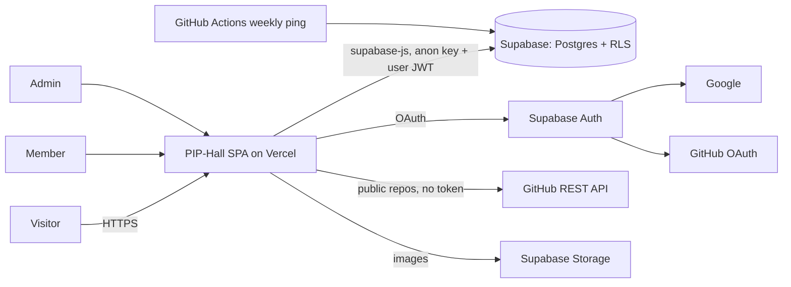
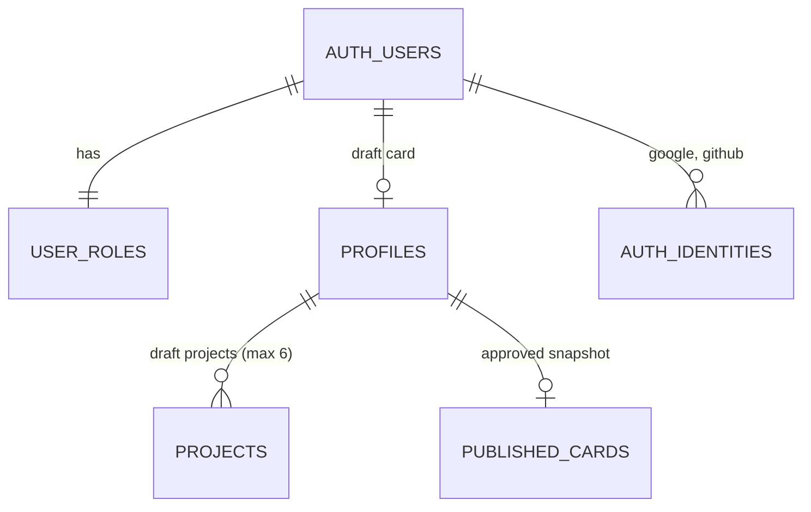
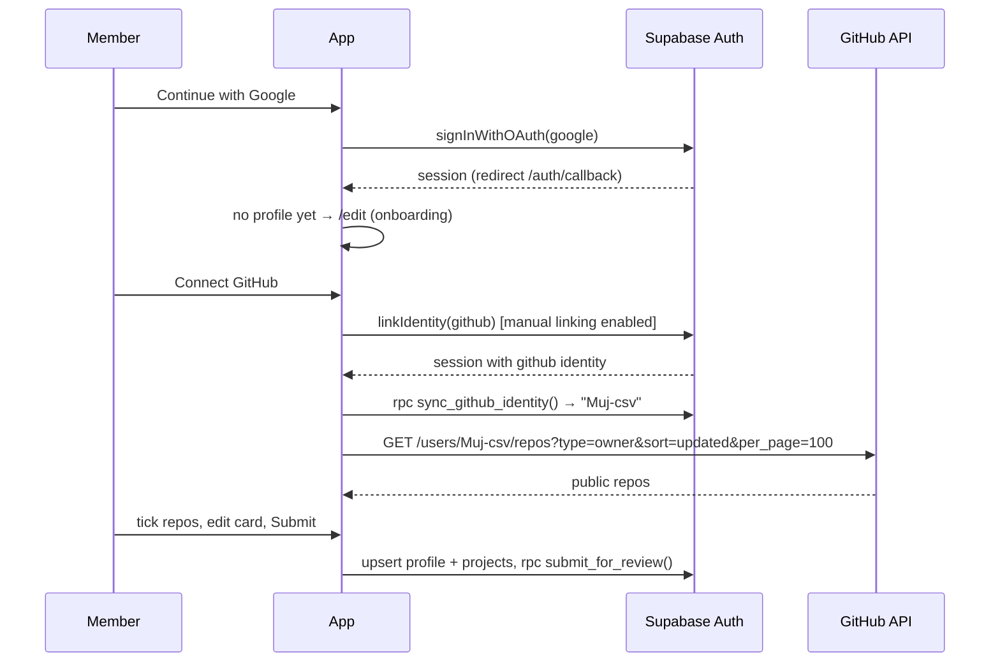

# PIP-Hall — Architecture

Version 1.0 · 2026-10-04 · Status: Accepted for build · Owner: Jum Flores
Inputs: original spec (`docs/spec/`), decisions (`docs/DECISIONS.md`), design (`docs/design/DESIGN_BRIEF.md`, `tokens.json`).

## 1. Overview

A React single-page app (Vite, TypeScript, Tailwind 4) talking directly to Supabase (Postgres, Auth, Storage). No server of our own. Security lives in the database: Row Level Security, column grants, and a handful of `security definer` functions for state changes. Visitors read one public table of approved card snapshots; members edit private drafts; admins publish drafts into snapshots. Hosted as static files on Vercel, installable as a PWA.



## 2. Requirements in scope (for 6 Oct)

| ID | Requirement | Source |
|---|---|---|
| FR-01 | Sign in with Google; sign out; session persists | D-003, spec |
| FR-02 | Connect GitHub to the account; card shows the verified handle | D-003 |
| FR-03 | Create/edit a card with live preview; username, name, role, org position, department, tagline, bio, links, skills | spec |
| FR-04 | Upload a photo (resized and compressed in the browser); generated pixel avatar when none | spec, brief |
| FR-05 | Pick up to 6 public GitHub repos, reorder, override description, refresh | D-003, D-016 |
| FR-06 | Add manual projects | D-007 |
| FR-07 | Submit for review; see status and admin note | spec, D-002 |
| FR-08 | Admin: queue, approve, reject with note, unpublish, feature, rename | spec |
| FR-09 | Public carousel of approved cards: drag, swipe, arrows, keyboard | spec |
| FR-10 | Flip card front/back | spec |
| FR-11 | `/member/:username` works without login, from a cold link | spec |
| FR-12 | QR on every card → its public URL; full-screen QR view | spec |
| FR-13 | Search by name, handle, role, skill, project; filter by department, skill, featured | spec |
| FR-14 | Installable PWA, offline shell, iOS instructions | spec |
| FR-15 | DAY / NIGHT / SYSTEM theme | D-004 |
| FR-16 | Settings: email opt-in, show email, sign out, delete account | spec |

| ID | Non-functional target |
|---|---|
| NFR-01 | Home interactive < 2.5s on a mid Android over 4G; JS < 200 KB gzipped on first load (editor/admin lazy) |
| NFR-02 | Carousel holds 60fps on drag with 300 cards (only current ±2 rendered) |
| NFR-03 | WCAG 2.2 AA (verified tokens), full keyboard path, reduced motion |
| NFR-04 | Zero paid services; stays within Supabase and Vercel free tiers at ≤ 500 members |
| NFR-05 | No service-role key or OAuth secret in the client bundle or repo |

## 3. Stack

Pin exact versions at scaffold time (`npm view <pkg> version` on 4 Oct showed): React 19.3, Vite 8.3, **TypeScript 6.0.3** (not 7.x: `typescript-eslint` 8.71 supports `typescript <6.1.0`, D-028), Tailwind CSS 4.3 (`@tailwindcss/vite`), React Router 8.4 (library mode), `@supabase/supabase-js` 2.117, `vite-plugin-pwa` 2.0, `qrcode.react` 4.2 (photos are resized with the native canvas, D-035), `@fontsource/jersey-10`, `@fontsource/atkinson-hyperlegible-next`, `@fontsource/atkinson-hyperlegible-mono`, Vitest 5, Playwright 1.63. If a plugin doesn't support Vite 8 yet, drop to the newest Vite it supports rather than patching.

Not used, on purpose: Embla (ADR-001), a state library (local state + small hooks), a CSS component library (custom on tokens), any analytics.

## 4. Data model



- **profiles** — the member's private draft. Status: `draft → pending_review → approved | rejected`, `approved → unpublished`. Any content edit by the member sets status back to `draft` (trigger). Moderation columns (`status`, `is_featured`, `review_note`, `github_username`, `username_locked`) have **no update grant** for members.
- **projects** — private draft rows, `source` = `github | manual`; GitHub rows carry `github_repo_id` (unique per profile). Max 6 (trigger).
- **published_cards** — the only table visitors read. One row per approved member: `username`, `card jsonb` (everything the public card and profile page show, including projects), `is_featured`, `member_no`. Written only by admin functions (ADR-002).
- **member numbers** — `profiles.member_no` is assigned from `member_no_seq` at a member's first approval and never changes or gets reused (D-034); it is the No.### on the badge and in the QR serial.
- **user_roles** — `member | admin`, created by trigger on sign-up; promoted only from the SQL editor (`supabase/seed_first_admin.sql`).
- Storage: `avatars/<uid>/<uuid>.webp`, `project-covers/<uid>/<uuid>.webp`, public read, owner-only write, 2 MB limit, images only. New file name on every upload so approved snapshots keep their image. Rows store the **path** (`profiles.avatar_path`, `projects.cover_path`), never a URL; a check constraint pins it to the owner's folder, and the client builds the public URL (D-027).

Source of truth: `supabase/migrations/`. Tests: `supabase/tests/security.test.mjs` (61 checks, all passing on 4 Oct).

## 5. Security model

| Actor | Can | Enforced by |
|---|---|---|
| Visitor (anon) | read `published_cards` | RLS + grant (select only) |
| Member | read/insert/update own `profiles` content columns; CRUD own `projects`; call `submit_for_review`, `sync_github_identity`, `delete_my_account` | RLS (`id = auth.uid()`), column grants, definer functions |
| Admin | read all drafts; `approve_profile`, `reject_profile`, `unpublish_profile`, `set_featured`, `admin_set_username` | `is_admin()` check inside each definer function |
| Nobody via API | write `published_cards`, `user_roles`, moderation columns; call `build_card` | no grants |

- `is_admin()` is `security definer` to avoid RLS recursion. All definer functions pin `search_path = ''`.
- The GitHub handle comes from `auth.identities` (verified by GitHub), never from a form.
- URLs are validated twice: client (zod-style validators in `src/lib/validate.ts`) and database `check` constraints (https only, LinkedIn domain, GitHub repo URL shape).
- Public email only enters the snapshot when `show_email` is on; shown on the card as tap-to-reveal text.
- Keys: only `VITE_SUPABASE_URL` and `VITE_SUPABASE_ANON_KEY` in the client. Google and GitHub client secrets live only in the Supabase dashboard.

## 6. Auth and GitHub flow (ADR-003)



Failure cases the UI must handle: Google popup closed (stay on login, dialogue hint); GitHub already linked to another account (`identity_already_exists` → message + "sign in with the account that owns it"); GitHub API 403 rate limit (show reset time from `x-ratelimit-reset`, manual form still works); GitHub user has 0 public repos (empty state → manual form).

Supabase settings required: Google + GitHub providers on; **Manual linking enabled** (beta); Site URL and redirect URLs include the Vercel domain and `http://localhost:5173`. Google OAuth consent screen **In production** with only `openid email profile`.

## 7. Frontend

```text
src/
  app/            router.tsx, providers (session, theme), RequireAuth, RequireAdmin
  pages/          Home, Explore, Member, Login, AuthCallback, Edit, Admin, Settings, NotFound
  components/
    shell/        HandheldShell, Stage, HardwareBar, TopBar, ThemeToggle, InstallPrompt
    cards/        MemberCard, CardFront, CardBack, Lanyard, Sticker, PixelAvatar, QrBadge, QrFullscreen
    carousel/     CardCarousel, useCarousel (index, drag, keyboard, swing)
    dialogue/     DialogueBox, Emote
    pixel/        PixelButton, PixelInput, PixelTextarea, PixelPanel, PixelIcon (SVG sprites)
    editor/       CardEditor, IdentityFields, LinksFields, SkillsInput, RepoPicker, ProjectList, ManualProjectForm, StatusBanner
    admin/        ModerationQueue, ReviewPanel
  services/       supabase.ts (client), cardService.ts (public), profileService.ts, projectService.ts, githubService.ts, adminService.ts, storageService.ts
  lib/            validate.ts, image.ts (resize/compress), avatar.ts (sprite), search.ts, theme.ts
  types/          card.ts (PublicCard, DraftProfile, Project), db.ts (generated)
  data/           sample-cards.json  (fixture for Phase 1 and tests only; never imported by pages directly)
  styles/         theme.css (generated), base.css
```

Rules: components never import `supabase.ts`; only `services/` do. Pages get data from hooks that call services. `cardService` has two implementations behind one interface (`fixture`, `supabase`), chosen by `VITE_DATA_SOURCE`, so the card and carousel are built on fixtures first and switch with no component changes.

Routes: `/` home carousel · `/explore` grid + search + filters · `/member/:username` public page · `/login` · `/auth/callback` · `/edit` (create and edit; `/create` redirects) · `/admin` (admin only) · `/settings` · `*` not found. Member page, editor, admin and settings are lazy chunks.

Search (FR-13): `cardService.listPublished()` loads all `published_cards` once (≈ 2–3 KB each; 300 cards ≈ 0.8 MB, cached by the service worker) and `lib/search.ts` filters in memory with a normalized haystack per card.

## 8. PWA and caching

`vite-plugin-pwa` with `generateSW`: precache the app shell and the Latin font files; runtime cache `GET /rest/v1/published_cards*` network-first with a 4 s timeout (1 day, D-042), storage images cache-first (30 days, 200 entries). Never cache auth or write requests. Manifest: name "PIP-Hall", short name "PIP-Hall", `display: standalone`, theme colour `color.bezel`, original pixel icons 192/512 + maskable. iOS: `apple-touch-icon`, `apple-mobile-web-app-capable`, an InstallPrompt sheet with Share → Add to Home Screen steps.

## 9. Deploy, environments, CI

- Vercel project from the GitHub repo; `vercel.json` rewrites everything that isn't a file to `/index.html` (FR-11 cold links).
- Env: `VITE_SUPABASE_URL`, `VITE_SUPABASE_ANON_KEY`, `VITE_DATA_SOURCE=supabase`, `VITE_PUBLIC_ORIGIN` (used in QR codes).
- Migrations applied with the Supabase SQL editor (paste files in order) or `supabase db push`.
- GitHub Actions: `ci.yml` (typecheck, lint, unit tests, build, the SQL security tests) on every push; `keepalive.yml` weekly `GET published_cards?limit=1` so the free project doesn't pause. Check Supabase's terms before relying on it.

## 10. Risks

| Risk | Impact | Likelihood | Mitigation |
|---|---|---|---|
| Manual identity linking is beta | GitHub connect fails | Low | Fallback: manual GitHub username field marked "unverified" (no verified sticker) |
| Google consent screen left in Testing | Only test users can sign in | Medium | Setup checklist step; Gate 2 tests with a second Google account |
| Free project pauses | Cards and QRs dead | Medium (breaks) | keepalive workflow |
| Tool versions newer than examples (Vite 8, RR 8; TS held at 6.0.3, D-028) | Plugin incompatibility on scaffold | Medium | Pin to the newest set that builds; Phase 1 starts with a clean build |
| Scope vs 2.5 days | Unfinished features | Medium | Cut list in the plan; nothing new after Tue noon |

## 11. Traceability

| FR | Components | Test |
|---|---|---|
| FR-01/02 | Login, AuthCallback, RepoPicker, `sync_github_identity` | Playwright (mock auth) + manual Gate 2 |
| FR-03/04/06 | CardEditor, PixelAvatar, `lib/image.ts` | Vitest (validators, image), Playwright |
| FR-05 | RepoPicker, `githubService` | Vitest with recorded responses |
| FR-07/08 | StatusBanner, ModerationQueue, SQL functions | `security.test.mjs` + Playwright |
| FR-09/10 | CardCarousel, MemberCard | Playwright: drag, keys, flip; AEGIS render check |
| FR-11/12 | Member page, QrBadge, `vercel.json` | Playwright cold load + real phone scan |
| FR-13 | Explore, `lib/search.ts` | Vitest |
| FR-14 | manifest, service worker | Lighthouse PWA audit + phone install |
| FR-15 | ThemeToggle, tokens | AEGIS contrast (both modes) |
| FR-16 | Settings, `delete_my_account` | `security.test.mjs` + Playwright |
